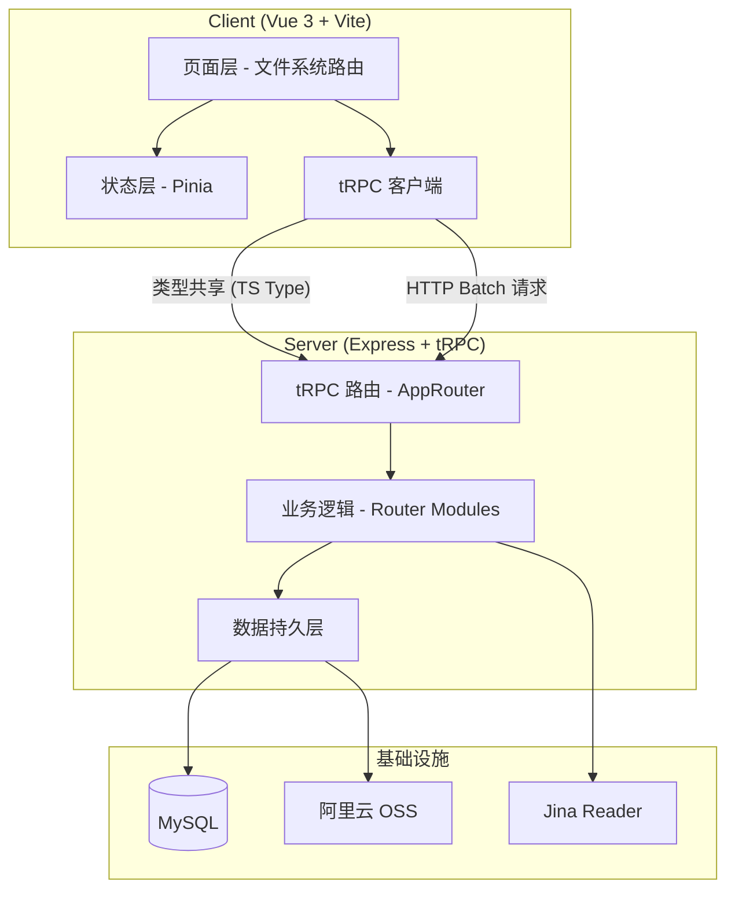

# notPad

一个自托管的个人知识管理工具。笔记、书签、图床、网盘，四个核心模块用一套 tRPC 类型安全链路贯穿前后端。

## 技术栈

| 层 | 选型 |
|---|---|
| 前端 | Vue 3 + TypeScript + Vite + Vuetify 3 + Pinia |
| 后端 | Express 5 + tRPC + Zod 4 |
| 数据库 | MySQL |
| 对象存储 | 阿里云 OSS（预签名直传） |
| 外部服务 | Jina Reader（书签网页元数据抓取） |

前后端共享类型定义，运行时走 HTTP batch 请求，开发时 `concurrently` 同时起前后端热重载。

## 功能

### 笔记

Markdown 编辑器，支持：

- **标签系统** — 多对多关联，筛选查找
- **插入资源引用** — 通过资源选择器插入站内图片、文件、笔记、书签，渲染为可交互卡片
- **粘贴图片** — 剪贴板图片直接粘贴，自动上传 OSS 并插入 Markdown 图片链接

  

- **资源卡片** — ` ```notecard ` 代码块嵌入 note / file / bookmark 三种内部资源，如文件卡片：

  ````
  ```notecard
  {"type":"file","name":"HarmonyOS+Sans.zip","url":"https://monika.jkloli.net/file/d033e22ae3-1774713094388-15070e27-b20d-4624-9196-68da4def9ec1.zip","size":52136595,"mime":"application/zip"}
  ```
  ````

  笔记引用卡片：

  ````
  ```notecard
  {"type":"note","id":"0263bb2d7fa7a3f86610d128f3191f354834","title":"debian 新维护手册"}
  ```
  ````

- **Mermaid 图表** — ` ```mermaid ` 代码块实时渲染为 SVG

- **图片预览** — Viewer.js 驱动的全功能图片查看器
- **视频播放** — 自动识别视频链接渲染为 `<video>` 播放器
- **目录导航** — 自动生成 TOC，侧边栏/移动端抽屉跳转
- **快捷保存** — Ctrl/Cmd + S

### 书签

- **外部 URL** — 粘贴链接，自动通过 Jina Reader 抓取标题、描述、正文
- **内部资源收藏** — 收藏站内笔记、图片、文件，通过 `ref_id` 关联，自动去重
- **标签系统** — 独立的书签标签，分类管理
- **内容渲染** — 抓取的网页正文支持 Markdown 渲染展示

### 图床

- **OSS 直传** — 预签名 PUT URL，客户端直传阿里云 OSS
- **元数据管理** — 上传后自动登记文件信息到 MySQL
- **标签系统** — 图片标签，分类检索
- **列表搜索** — 搜索、排序、分页浏览

### 网盘

- **文件夹** — 创建文件夹，支持父子层级，同级重名校验
- **文件上传** — OSS 预签名直传
- **面包屑导航** — 目录层级路径导航
- **搜索** — 当前目录 / 全局搜索
- **重命名** — 文件和文件夹重命名
- **下载** — 公网直链下载

### 首页时间线

笔记、图片、文件、书签按时间 UNION 后分页展示，一目了然。

### 用户系统

- SHA256 密码加密
- Token 认证，多设备管理
- 设备别名、Token 吊销
- 用户个性化设置（主题等）

## 项目结构

```
notPad/
├── client/                 # Vue 3 前端
│   └── src/
│       ├── pages/          # 文件系统路由
│       │   ├── index.vue          # 首页时间线
│       │   ├── notes.vue          # 笔记列表
│       │   ├── note/[id].vue      # 笔记详情/编辑
│       │   ├── note/create.vue    # 新建笔记
│       │   ├── image.vue          # 图床
│       │   ├── file.vue           # 网盘
│       │   ├── bookmark/          # 书签
│       │   ├── account.vue        # 账户
│       │   └── setting/           # 设置
│       ├── components/     # 通用组件
│       └── store/          # Pinia 状态管理
├── server/                 # Express + tRPC 后端
│   └── src/
│       ├── router/         # tRPC 子路由
│       │   ├── auth.ts            # 认证
│       │   ├── notepad.ts         # 笔记
│       │   ├── image_bed.ts       # 图床
│       │   ├── file_drive.ts      # 网盘
│       │   └── bookmark.ts        # 书签
│       ├── utils/
│       │   ├── sqlData.ts         # MySQL 数据层
│       │   └── aliOss.ts          # OSS 操作
│       └── database.ts     # 建表/迁移
└── scripts/
    └── build.js            # 生产构建脚本
```

## 架构



## 开始使用

### 环境要求

- Node.js
- MySQL
- 阿里云 OSS Bucket
- Jina API Key（书签网页抓取，可选）

### 配置

复制 `server/src/config.example.ts` 为 `server/src/config.ts`，填入数据库、OSS、Jina 等配置。

### 开发

```bash
npm install
npm run dev
```

前后端同时启动，热重载。

### 构建部署

```bash
npm run build
```

构建产物在 `dist/` 目录，client 静态资源在 `dist/public/`，服务端编译产物与其并列。在 `dist/` 下 `npm install && node index.js` 即可启动。

## tRPC API 概览

| 路由 | 主要操作 |
|---|---|
| `auth` | register, login, verifyToken, getProfile, updateProfile, getTokens, revokeToken |
| `notepad` | getNotes, getNoteById, createNote, updateNote, deleteNote, 标签 CRUD |
| `image_bed` | getUploadUrl, addImage, rename, list, 标签 CRUD |
| `file_drive` | getUploadUrl, addFile, createFolder, list, renameFile, renameFolder, getDownloadUrl |
| `bookmark` | list, add, remove, isBookmarked, fetchUrl, getById, 标签 CRUD |
| `setting` | getAll, set, remove |
| `timeline` | 分页时间线聚合 |
